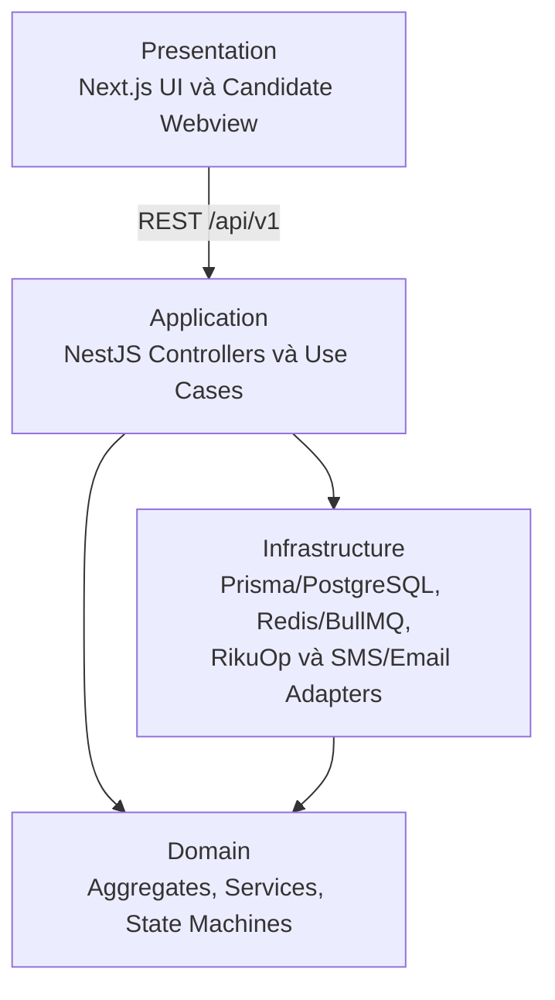
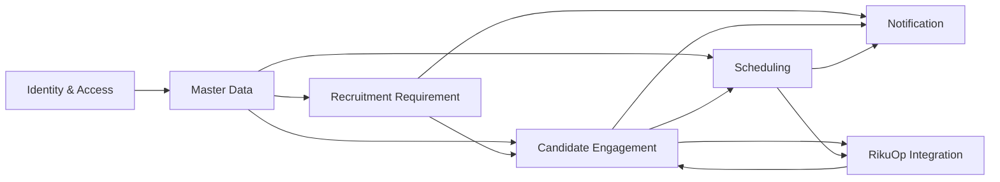
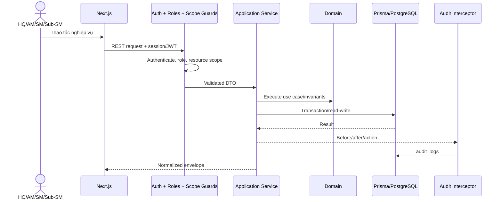
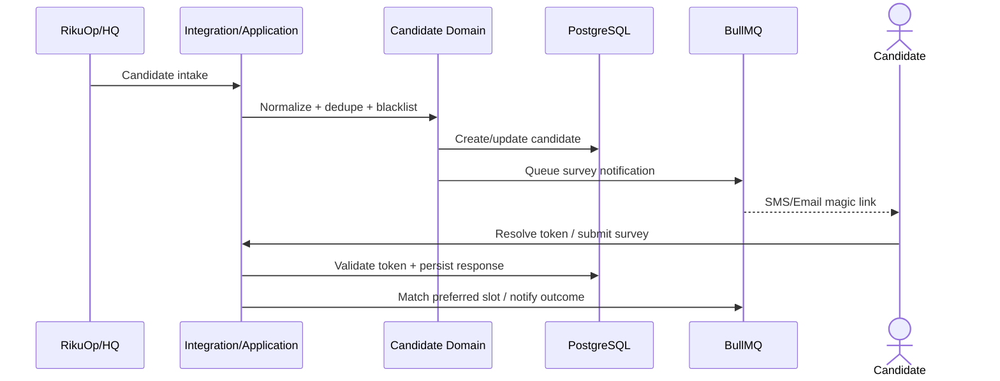
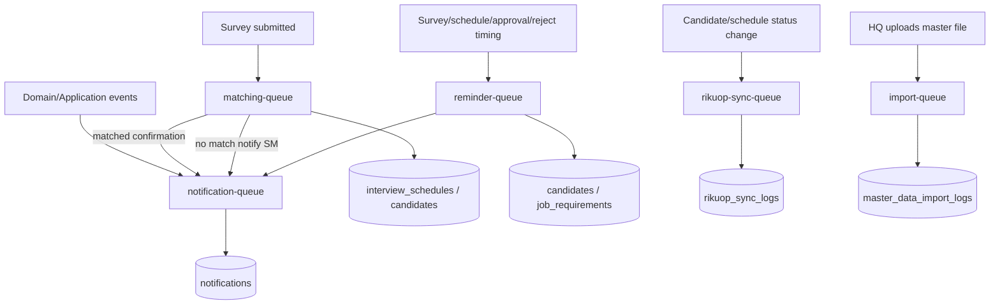
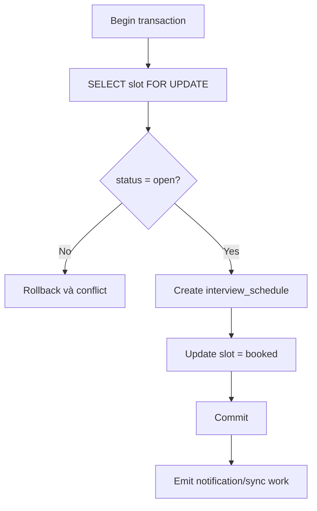
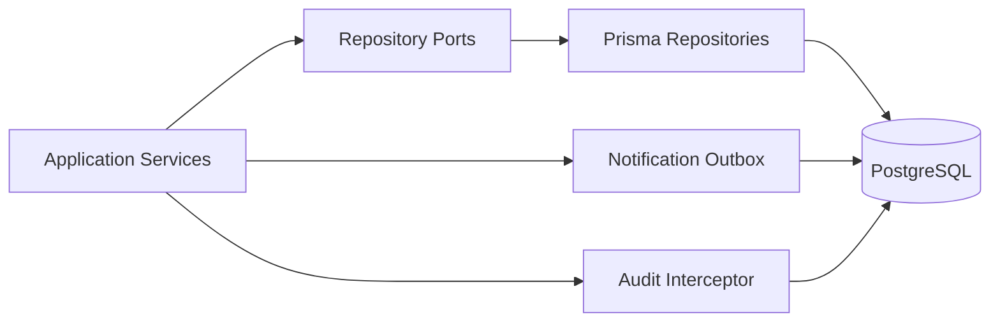
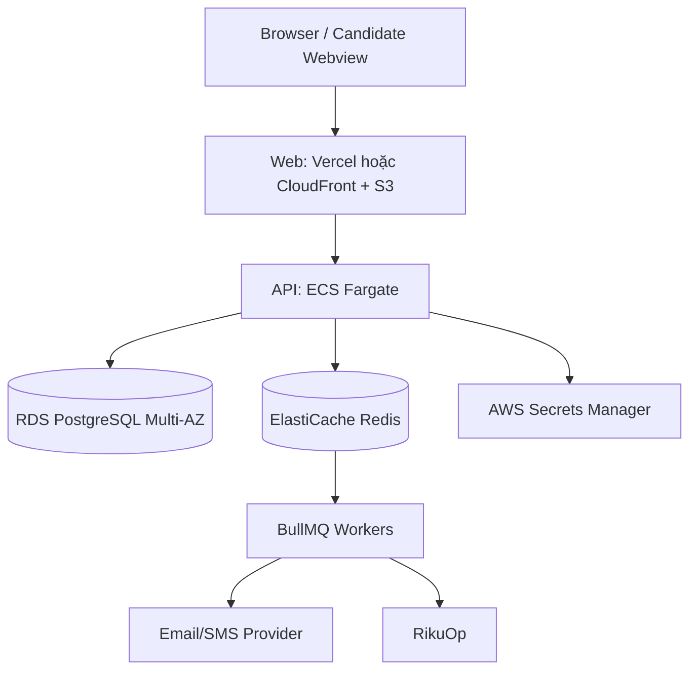

# ARCHITECTURE.md — Kiến trúc hệ thống Rakusai

## 1. Architectural drivers

- Domain logic độc lập với HTTP, queue, cron và provider hạ tầng.
- Authorization theo role và resource scope.
- Published requirement không bị ảnh hưởng bởi draft đang chỉnh sửa.
- Không silent lost update hoặc double booking.
- Notification không mất và không gửi trùng khi retry.
- RikuOp contract change được cô lập.
- AM/SM/Sub-SM mobile-first; HQ PC-first.
- Business time theo Asia/Tokyo, persistence theo UTC.

## 2. Technology stack

| Layer/Concern | Công nghệ |
|---|---|
| Web | Next.js App Router v16+, Tailwind CSS, shadcn/ui, react-day-picker, lucide-react |
| FE data/state | TanStack React Query, Zustand có chọn lọc |
| Form/validation | react-hook-form + zod |
| Date/time | date-fns + date-fns-tz |
| API | NestJS theo DDD, REST `/api/v1` |
| BE validation | class-validator + class-transformer |
| Persistence | Prisma + PostgreSQL |
| Background jobs | Redis + BullMQ |
| Contracts/HTTP | Swagger/OpenAPI, ResponseTransformInterceptor, HttpExceptionFilter |
| Cross-cutting | RolesGuard, ScopeGuard, audit interceptor, helmet, hpp, sanitizer, rate limit, compression, structured logger |

## 3. Kiến trúc bốn lớp

Dependency rule: Presentation gọi Application qua REST. Application orchestration gọi Domain và infrastructure ports. Domain không phụ thuộc framework hoặc provider. Infrastructure hiện thực persistence, queue và external adapters.

## 4. Bounded contexts

| Context | Aggregate/data sở hữu | Trách nhiệm |
|---|---|---|
| Identity & Access | User, Role, Session, AuditLog | Authentication, RBAC, password lifecycle, audit |
| Master Data | Area, Store, StoreManagerAssignment, AreaManagerAssignment | Org hierarchy, import/export, account provisioning |
| Recruitment Requirement | JobRequirement, JobRequirementVersion, ApprovalAction | Authoring, versioning, approval state machine |
| Scheduling | InterviewSlot, InterviewSchedule | Availability, conflict detection, booking, reschedule/cancel |
| Candidate Engagement | Candidate, SurveyToken, SurveyResponse, BlacklistEntry | Intake, dedupe, blacklist, survey, candidate outcome |
| Notification | Notification | Email/SMS outbox, retry, idempotency |
| RikuOp Integration | RikuopSyncLog, adapter | Inbound/outbound mapping, sync log, spec-drift detection |

Các mũi tên biểu diễn application-service/domain-event dependency, không cấp quyền truy cập trực tiếp bảng của context khác.

## 5. Request và data flow

### 5.1 Internal authenticated request

### 5.2 Candidate intake và survey

## 6. Background processing

### 6.1 Queue topology

### 6.2 Job catalog từ queue diagram

| Queue | Job | Trigger | Kết quả |
|---|---|---|---|
| `notification-queue` | notification dispatch | Candidate/internal event | Send qua provider; update notification `sent`/`failed` |
| `matching-queue` | `match-candidate-slot` | Survey có preferred dates | Thử theo priority; tạo schedule hoặc set adjustment-needed nghiệp vụ |
| `reminder-queue` | `auto-decline-candidate` | Survey link sent | +5 ngày không response → No Response, enqueue RikuOp sync |
| `reminder-queue` | `interview-reminder` | Schedule created | T-24h → enqueue candidate reminder |
| `reminder-queue` | `approval-reminder` | Requirement pending AM | Sau 3 ngày, repeat daily khi còn pending |
| `reminder-queue` | `edit-reminder` | Requirement rejected | Sau 3 ngày, repeat daily khi còn rejected |
| `rikuop-sync-queue` | `rikuop-outbound-sync` | Status/schedule changed | Call RikuOp, retry/backoff, log result |
| `rikuop-sync-queue` | `rikuop-inbound-candidate` | Validated webhook | Dedupe/blacklist, create candidate, queue notification |
| `import-queue` | `import-master-data` | HQ upload | Process rows, persist import result |

Không dùng Redis/BullMQ cho transaction commit của slot booking, optimistic requirement edit hoặc audit log write. Không đưa Kafka, SNS/SQS hay event sourcing vào phạm vi hiện tại.

## 7. Consistency và concurrency boundaries

### Recruitment edit

Client gửi version đã đọc. Stale version bị reject thay vì overwrite; client phải reload.

### Slot booking

DB bảo vệ thêm bằng unique schedule per slot và unique `(sm_user_id, slot_date, start_time)` theo thiết kế nguồn.

## 8. Persistence architecture

- UUID primary key.
- Typed column cho filter/sort/status/date.
- JSONB cho evolving structured content đã được định nghĩa.
- Junction table cho assignments.
- Timestamp persist UTC; application/UI convert Asia/Tokyo.

## 9. Deployment topology

| Environment | Compute | PostgreSQL | Redis | Ghi chú |
|---|---|---|---|---|
| Local | Docker Compose: API + Web | Container | Container | Seed role/sample master data được tài liệu nguồn dự kiến |
| Staging | Docker Compose hoặc single ECS service | Container hoặc small RDS | Container | Mirror production config qua environment variables |
| Production | ECS Fargate API; Vercel hoặc CloudFront + S3 Web | Amazon RDS Multi-AZ | Amazon ElastiCache | Secrets Manager; SES/SNS hoặc transactional Email/SMS provider như Twilio |

Mọi connection được resolve qua `ConfigService` từ environment. Không branch application code theo môi trường.

## 10. Security và observability

- Salted password hash; không plaintext.
- FE zod validation không thay BE DTO validation.
- Uniform auth/authorization middleware chain.
- Public candidate endpoint rate limit.
- Secrets ngoài source control.
- Structured logging có request ID.
- Audit mutating request, bỏ GET.
- Health endpoint kiểm tra DB, Redis và dependent services phù hợp.
- RikuOp response-shape mismatch ghi riêng trong integration log.

## 11. Architectural open items

- RikuOp inbound webhook hay polling chờ final contract.
- Exact import formats chưa có.
- Reminder caps/windows/holiday rules chưa có.
- Production Web chọn Vercel hay CloudFront + S3 chưa được chốt trong nguồn.
- Staging chọn Docker Compose hay single ECS chưa được chốt.
- Cách HQ chọn responsible SM khi tạo slot cho multi-manager Store chưa chốt UX.

