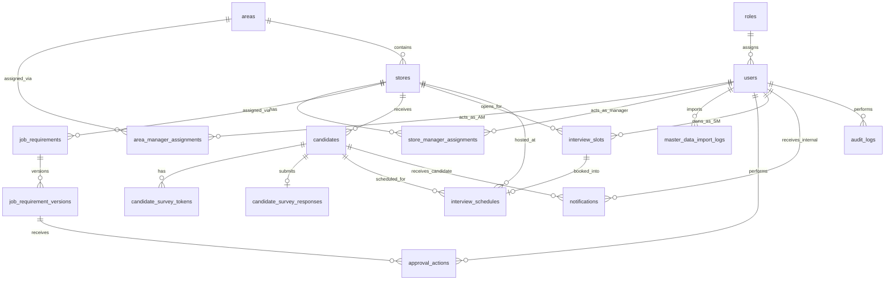

# DATABASE-SCHEMA.md — Cấu trúc Database và ERD

## 1. Trạng thái

Tài liệu này phản ánh thiết kế logic hiện tại, chưa phải migration/Prisma schema đã triển khai. Nguồn chuẩn là `Rakusai-System-Database-Design.md` §6, được kiểm chứng với `rakusai_er_diagram.drawio`.

## 2. Nguyên tắc

- PostgreSQL, truy cập qua Prisma.
- Surrogate UUID primary key cho mọi table.
- Timestamp persist UTC; business logic/hiển thị theo `Asia/Tokyo`.
- JSONB dùng cho structured content còn thay đổi: requirement payload, survey fields, notification payload và schedule location information.
- Status/store/date và field cần filter/sort là typed column.
- State dùng PostgreSQL ENUM hoặc checked VARCHAR; lựa chọn migration chưa chốt.
- Store↔SM và Area↔AM dùng junction table.
- `created_by`, `updated_by`, `created_at`, `updated_at` là định hướng audit chung; tuy nhiên source table definitions không khai báo đủ bốn field ở mọi bảng. Không tự thêm các cột còn thiếu trước khi schema được xác nhận.

## 3. Tổng quan 19 bảng

| Bounded context | Tables |
|---|---|
| Identity & Access | `roles`, `users`, `audit_logs` |
| Master Data | `areas`, `stores`, `area_manager_assignments`, `store_manager_assignments`, `master_data_import_logs` |
| Recruitment Requirement | `job_requirements`, `job_requirement_versions`, `approval_actions` |
| Scheduling | `interview_slots`, `interview_schedules` |
| Candidate Engagement | `candidates`, `candidate_survey_tokens`, `candidate_survey_responses`, `blacklist_entries` |
| Notification | `notifications` |
| RikuOp Integration | `rikuop_sync_logs` |

## 4. Enum/value registry

| Domain | Values hiện được schema định nghĩa |
|---|---|
| User status | `active`, `inactive` |
| Store publish status | `draft`, `published`, `unpublished` |
| Requirement channel | `web`, `other_media` |
| Requirement status | `draft`, `pending_am`, `approved_am`, `pending_hq`, `approved_hq`, `rejected` |
| Approval action | `submit`, `approve`, `reject` |
| Candidate status | `received`, `survey_sent`, `survey_completed`, `no_response`, `passed`, `failed`, `interview_scheduled`, `interview_completed`, `cancelled` |
| Interview type | `web`, `onsite` |
| Slot status | `open`, `booked`, `closed` |
| Schedule status | `scheduled`, `changed`, `cancelled`, `completed` |
| Notification recipient | `candidate`, `internal_user` |
| Notification channel | `sms`, `email` |
| Notification status | `scheduled`, `sent`, `failed` |
| RikuOp direction | `inbound`, `outbound` |
| RikuOp status | `success`, `failed` |
| Master import type | `area`, `store`, `sm`, `sub_sm`, `am` |

## 5. Table definitions

### 5.1 Identity & Access

#### `roles`

Fixed role set stored as data để có thể thêm role administratively.

| Column | Type | Nullable | Constraint/meaning |
|---|---|---:|---|
| `id` | UUID | NO | PK |
| `code` | VARCHAR(20) | NO | UNIQUE; `HQ`, `AM`, `SM`, `SUB_SM` |
| `name` | VARCHAR(100) | NO | Display name |
| `description` | TEXT | YES | Optional description |
| `created_at` | TIMESTAMPTZ | NO | Audit timestamp |
| `updated_at` | TIMESTAMPTZ | NO | Audit timestamp |

#### `users`

Internal actors; Candidate không nằm trong bảng này.

| Column | Type | Nullable | Constraint/meaning |
|---|---|---:|---|
| `id` | UUID | NO | PK |
| `employee_code` | VARCHAR(50) | NO | UNIQUE; master-data identifier |
| `email` | VARCHAR(255) | NO | UNIQUE; contact/login use chưa được map đầy đủ |
| `password_hash` | VARCHAR(255) | NO | bcrypt/argon2 salted hash |
| `full_name` | VARCHAR(255) | NO | Display name |
| `phone` | VARCHAR(20) | YES | Contact number |
| `role_id` | UUID | NO | FK → `roles.id` |
| `status` | ENUM(active, inactive) | NO | Default active |
| `last_login_at` | TIMESTAMPTZ | YES | Last successful login |
| `created_by` | UUID | YES | Actor reference |
| `updated_by` | UUID | YES | Actor reference |
| `created_at` | TIMESTAMPTZ | NO | Audit timestamp |
| `updated_at` | TIMESTAMPTZ | NO | Audit timestamp |

#### `audit_logs`

Global operation log cho mutating requests; `actor_id` null khi system initiated.

| Column | Type | Nullable | Constraint/meaning |
|---|---|---:|---|
| `id` | UUID | NO | PK |
| `actor_id` | UUID | YES | Acting user |
| `actor_role` | VARCHAR(20) | YES | Role tại thời điểm action |
| `action` | VARCHAR(50) | NO | create/update/delete/approve/reject/login… |
| `entity_type` | VARCHAR(100) | NO | Aggregate/table bị tác động |
| `entity_id` | VARCHAR(100) | YES | Record bị tác động |
| `before_data` | JSONB | YES | State trước thay đổi |
| `after_data` | JSONB | YES | State sau thay đổi |
| `ip_address` | VARCHAR(45) | YES | Request origin |
| `user_agent` | TEXT | YES | Request client |
| `created_at` | TIMESTAMPTZ | NO | Action timestamp |

### 5.2 Master Data

#### `areas`

| Column | Type | Nullable | Constraint/meaning |
|---|---|---:|---|
| `id` | UUID | NO | PK |
| `code` | VARCHAR(50) | NO | UNIQUE |
| `name` | VARCHAR(255) | NO | Area name |
| `block` | VARCHAR(100) | YES | Chờ master-data template xác nhận |
| `created_by` | UUID | YES | Actor reference |
| `updated_by` | UUID | YES | Actor reference |
| `created_at` | TIMESTAMPTZ | NO | Audit timestamp |
| `updated_at` | TIMESTAMPTZ | NO | Audit timestamp |

#### `stores`

| Column | Type | Nullable | Constraint/meaning |
|---|---|---:|---|
| `id` | UUID | NO | PK |
| `code` | VARCHAR(50) | NO | UNIQUE |
| `name` | VARCHAR(255) | NO | Store name |
| `area_id` | UUID | NO | FK → `areas.id` |
| `prefecture` | VARCHAR(100) | YES | Chờ master-data template xác nhận |
| `address` | TEXT | YES | Full address |
| `allow_car_commute` | BOOLEAN | NO | Default true; điều khiển candidate notice |
| `publish_status` | ENUM(draft, published, unpublished) | NO | Candidate application availability |
| `created_by` | UUID | YES | Actor reference |
| `updated_by` | UUID | YES | Actor reference |
| `created_at` | TIMESTAMPTZ | NO | Audit timestamp |
| `updated_at` | TIMESTAMPTZ | NO | Audit timestamp |

#### `area_manager_assignments`

| Column | Type | Nullable | Constraint/meaning |
|---|---|---:|---|
| `id` | UUID | NO | PK |
| `area_id` | UUID | NO | FK → `areas.id` |
| `am_user_id` | UUID | NO | FK → `users.id`; user phải là AM theo application rule |
| `created_at` | TIMESTAMPTZ | NO | Assignment timestamp |

Unique: `(area_id, am_user_id)`.

#### `store_manager_assignments`

| Column | Type | Nullable | Constraint/meaning |
|---|---|---:|---|
| `id` | UUID | NO | PK |
| `store_id` | UUID | NO | FK → `stores.id` |
| `user_id` | UUID | NO | FK → `users.id`; SM/Sub-SM |
| `is_primary` | BOOLEAN | NO | true = primary SM, false = Sub-SM |
| `created_at` | TIMESTAMPTZ | NO | Audit timestamp |
| `updated_at` | TIMESTAMPTZ | NO | Audit timestamp |

Unique được source ghi: `(store_id, user_id)`. Rule “exactly one primary SM per Store” chưa có partial unique constraint được mô tả.

#### `master_data_import_logs`

| Column | Type | Nullable | Constraint/meaning |
|---|---|---:|---|
| `id` | UUID | NO | PK |
| `import_type` | ENUM(area, store, sm, sub_sm, am) | NO | Imported entity type |
| `file_name` | VARCHAR(255) | NO | Original file name |
| `imported_by` | UUID | NO | FK → `users.id`; HQ actor |
| `total_rows` | INTEGER | NO | Row count |
| `success_rows` | INTEGER | NO | Successful rows |
| `failed_rows` | INTEGER | NO | Failed rows |
| `error_detail` | JSONB | YES | Per-row errors |
| `created_at` | TIMESTAMPTZ | NO | Import timestamp |

### 5.3 Recruitment Requirement

#### `job_requirements`

| Column | Type | Nullable | Constraint/meaning |
|---|---|---:|---|
| `id` | UUID | NO | PK |
| `store_id` | UUID | NO | FK → `stores.id` |
| `channel` | ENUM(web, other_media) | NO | UNIQUE cùng `store_id` |
| `status` | ENUM(draft, pending_am, approved_am, pending_hq, approved_hq, rejected) | NO | Approval state |
| `current_version_id` | UUID | YES | FK → `job_requirement_versions.id`; edit/review version |
| `published_version_id` | UUID | YES | FK → `job_requirement_versions.id`; candidate-visible version |
| `created_by` | UUID | YES | Actor reference |
| `updated_by` | UUID | YES | Actor reference |
| `created_at` | TIMESTAMPTZ | NO | Audit timestamp |
| `updated_at` | TIMESTAMPTZ | NO | Audit timestamp |

Unique: `(store_id, channel)`.

#### `job_requirement_versions`

| Column | Type | Nullable | Constraint/meaning |
|---|---|---:|---|
| `id` | UUID | NO | PK |
| `job_requirement_id` | UUID | NO | FK → `job_requirements.id` |
| `version_no` | INTEGER | NO | Sequential per requirement |
| `payload` | JSONB | NO | experience, wage, hours, dress code, items to bring, event-work flag… |
| `submitted_by` | UUID | YES | FK → `users.id` |
| `submitted_at` | TIMESTAMPTZ | YES | Submission timestamp |
| `created_at` | TIMESTAMPTZ | NO | Creation timestamp |

Unique: `(job_requirement_id, version_no)`.

#### `approval_actions`

Append-only log.

| Column | Type | Nullable | Constraint/meaning |
|---|---|---:|---|
| `id` | UUID | NO | PK |
| `job_requirement_version_id` | UUID | NO | FK → `job_requirement_versions.id` |
| `actor_id` | UUID | NO | FK → `users.id` |
| `action` | ENUM(submit, approve, reject) | NO | Action type |
| `comment` | TEXT | YES | Mandatory bằng application validation khi reject |
| `created_at` | TIMESTAMPTZ | NO | Action timestamp |

### 5.4 Candidate Engagement

#### `blacklist_entries`

| Column | Type | Nullable | Constraint/meaning |
|---|---|---:|---|
| `id` | UUID | NO | PK |
| `full_name` | VARCHAR(255) | YES | Candidate name nếu biết |
| `phone` | VARCHAR(20) | YES | Indexed lookup |
| `email` | VARCHAR(255) | YES | Indexed lookup |
| `reason` | TEXT | YES | Blacklist reason |
| `created_by` | UUID | YES | Actor reference |
| `updated_by` | UUID | YES | Actor reference |
| `created_at` | TIMESTAMPTZ | NO | Audit timestamp |
| `updated_at` | TIMESTAMPTZ | NO | Audit timestamp |

`RULE.md` yêu cầu thêm name Kanji/Kana, date of birth, primary/secondary email và bắt buộc phone/name; các field/ràng buộc này không tồn tại trong source schema ưu tiên nên được ghi issue, không tự thêm tại đây.

#### `candidates`

| Column | Type | Nullable | Constraint/meaning |
|---|---|---:|---|
| `id` | UUID | NO | PK |
| `rikuop_candidate_id` | VARCHAR(100) | NO | UNIQUE external reference |
| `full_name` | VARCHAR(255) | NO | Candidate name |
| `phone` | VARCHAR(20) | YES | Dedupe/blacklist/SMS |
| `email` | VARCHAR(255) | YES | Dedupe/blacklist/email delivery |
| `store_id` | UUID | YES | FK → `stores.id` |
| `status` | Candidate status ENUM | NO | Xem §4 |
| `is_duplicate` | BOOLEAN | NO | Default false |
| `is_blacklisted` | BOOLEAN | NO | Default false |
| `source` | VARCHAR(50) | YES | Ví dụ `rikuop`, `hq_manual` |
| `created_at` | TIMESTAMPTZ | NO | Audit timestamp |
| `updated_at` | TIMESTAMPTZ | NO | Audit timestamp |

#### `candidate_survey_tokens`

| Column | Type | Nullable | Constraint/meaning |
|---|---|---:|---|
| `id` | UUID | NO | PK |
| `candidate_id` | UUID | NO | FK → `candidates.id` |
| `token_hash` | VARCHAR(255) | NO | UNIQUE; không lưu plaintext token |
| `expires_at` | TIMESTAMPTZ | NO | Check server-side |
| `used_at` | TIMESTAMPTZ | YES | Set first use khi token single-use |
| `created_at` | TIMESTAMPTZ | NO | Issue timestamp |

#### `candidate_survey_responses`

Một response duy nhất trên mỗi candidate.

| Column | Type | Nullable | Constraint/meaning |
|---|---|---:|---|
| `id` | UUID | NO | PK |
| `candidate_id` | UUID | NO | FK → `candidates.id`; UNIQUE |
| `desired_store_ids` | JSONB | NO | Applied stores cho duplicate case |
| `experience` | TEXT | YES | Food-service experience |
| `desired_working_hours` | JSONB | YES | Preferred hours |
| `desired_period` | VARCHAR(100) | YES | Employment duration |
| `desired_days_per_week` | VARCHAR(50) | YES | Working days |
| `other_conditions` | TEXT | YES | Free text |
| `event_work` | BOOLEAN | NO | Default false |
| `contact_available_days` | JSONB | YES | Contact days |
| `contact_available_time` | JSONB | YES | Contact time window |
| `car_commute_note` | TEXT | YES | Store disallows car commute note |
| `interview_type` | ENUM(web, onsite) | NO | Preferred format |
| `preferred_dates` | JSONB | NO | Tối đa ba ranked choices |
| `submitted_at` | TIMESTAMPTZ | NO | Submission timestamp |

### 5.5 Scheduling

#### `interview_slots`

| Column | Type | Nullable | Constraint/meaning |
|---|---|---:|---|
| `id` | UUID | NO | PK |
| `store_id` | UUID | NO | FK → `stores.id` |
| `sm_user_id` | UUID | NO | FK → `users.id`; responsible manager |
| `slot_date` | DATE | NO | Interview date |
| `start_time` | TIME | NO | Slot start |
| `end_time` | TIME | NO | Slot end |
| `status` | ENUM(open, booked, closed) | NO | Availability |
| `note` | TEXT | YES | Schedule memo |
| `version` | INTEGER | NO | Optimistic lock counter |
| `created_by` | UUID | YES | Actor reference |
| `updated_by` | UUID | YES | Actor reference |
| `created_at` | TIMESTAMPTZ | NO | Audit timestamp |
| `updated_at` | TIMESTAMPTZ | NO | Audit timestamp |

Unique theo source: `(sm_user_id, slot_date, start_time)`. Rule không chồng chéo khoảng thời gian cần validation/constraint bổ sung vì unique start time không tự chặn mọi overlap.

#### `interview_schedules`

| Column | Type | Nullable | Constraint/meaning |
|---|---|---:|---|
| `id` | UUID | NO | PK |
| `candidate_id` | UUID | NO | FK → `candidates.id` |
| `slot_id` | UUID | NO | FK → `interview_slots.id`; UNIQUE |
| `store_id` | UUID | NO | FK → `stores.id` |
| `status` | ENUM(scheduled, changed, cancelled, completed) | NO | Lifecycle |
| `interview_type` | ENUM(web, onsite) | NO | Format |
| `location_info` | JSONB | YES | Address/directions/items/dress code hoặc web URL/notes |
| `reminder_sent_at` | TIMESTAMPTZ | YES | Set khi 1-day reminder dispatch |
| `created_by` | UUID | YES | Actor reference |
| `updated_by` | UUID | YES | Actor reference |
| `created_at` | TIMESTAMPTZ | NO | Audit timestamp |
| `updated_at` | TIMESTAMPTZ | NO | Audit timestamp |

### 5.6 Notification

#### `notifications`

| Column | Type | Nullable | Constraint/meaning |
|---|---|---:|---|
| `id` | UUID | NO | PK |
| `recipient_type` | ENUM(candidate, internal_user) | NO | Target type |
| `recipient_id` | UUID | NO | Candidate/User theo type; polymorphic, không FK được định nghĩa |
| `channel` | ENUM(sms, email) | NO | Delivery channel |
| `template_code` | VARCHAR(100) | NO | Template identifier |
| `payload` | JSONB | YES | Template variables |
| `status` | ENUM(scheduled, sent, failed) | NO | Delivery state |
| `idempotency_key` | VARCHAR(255) | NO | UNIQUE |
| `scheduled_at` | TIMESTAMPTZ | NO | Planned send time |
| `sent_at` | TIMESTAMPTZ | YES | Actual send time |
| `retry_count` | INTEGER | NO | Default 0 |
| `error_message` | TEXT | YES | Last failure |
| `created_at` | TIMESTAMPTZ | NO | Creation timestamp |

### 5.7 RikuOp Integration

#### `rikuop_sync_logs`

| Column | Type | Nullable | Constraint/meaning |
|---|---|---:|---|
| `id` | UUID | NO | PK |
| `direction` | ENUM(inbound, outbound) | NO | Call direction |
| `entity_type` | VARCHAR(50) | NO | Ví dụ candidate, interview_schedule |
| `entity_id` | VARCHAR(100) | YES | Internal/external related id |
| `request_payload` | JSONB | YES | Raw request data |
| `response_payload` | JSONB | YES | Raw response data |
| `status` | ENUM(success, failed) | NO | Outcome |
| `error_message` | TEXT | YES | Failure/contract mismatch detail |
| `created_at` | TIMESTAMPTZ | NO | Call timestamp |

Liên kết tới candidate/requirement/schedule là polymorphic qua `(entity_type, entity_id)`, không có DB-level FK.

## 6. ERD

Không vẽ FK cho `notifications.recipient_id` và `rikuop_sync_logs.entity_id` vì source xác định chúng là polymorphic/no DB-level FK. `blacklist_entries` được match bằng application logic với candidate phone/email, không có FK.

## 7. Transaction và concurrency

| Scenario | Cơ chế hiện tại |
|---|---|
| SM/Sub-SM cùng edit requirement | Optimistic version; stale write bị reject |
| HQ/SM cùng book slot | `SELECT ... FOR UPDATE` trong transaction + UI version |
| Cùng SM ở hai Store cùng thời điểm | Unique `(sm_user_id, slot_date, start_time)` + booking transaction |

Booking transaction: lock slot row → verify `status = open` → create `interview_schedules` → update slot `booked` → commit. Notification/sync được enqueue sau consistency boundary.

## 8. Index/constraint đã có cơ sở

- UNIQUE: `roles.code`, `users.employee_code`, `users.email`, `areas.code`, `stores.code`.
- UNIQUE composite: area assignment, store assignment, `(store_id, channel)`, `(job_requirement_id, version_no)`, SM slot key.
- UNIQUE: `candidates.rikuop_candidate_id`, `candidate_survey_tokens.token_hash`, survey response `candidate_id`, schedule `slot_id`, notification `idempotency_key`.
- Index được requirement nêu: `blacklist_entries.phone`, `blacklist_entries.email`; operational filter fields status/store/date.
- Exact index definitions, FK delete behavior, check constraints và isolation level chưa được source định nghĩa.

## 9. Schema gaps cần giải quyết trước migration

- Domain có `Interview Adjustment Needed`, candidate enum chưa có value tương ứng.
- `RULE.md` có slot `CANCELLED`, slot enum chỉ có `open/booked/closed`.
- Global audit-column principle không khớp tất cả table definitions.
- Unique slot start time không tự chặn mọi khoảng thời gian overlap.
- Exactly one primary SM per Store chưa có constraint được mô tả.
- Blacklist field/rule trong `RULE.md` rộng hơn source schema ưu tiên.
- `candidates.rikuop_candidate_id` là NOT NULL dù source cho phép HQ manual registration; cách cấp external reference cho manual record chưa định nghĩa.
- Circular FK giữa `job_requirements.current_version_id`/`published_version_id` và `job_requirement_versions.job_requirement_id` cần migration order/deferrable strategy chưa được định nghĩa.

Các gap này được theo dõi trong `ISSUES-LIST-TRACKING.md`; tài liệu này không tự quyết resolution.
