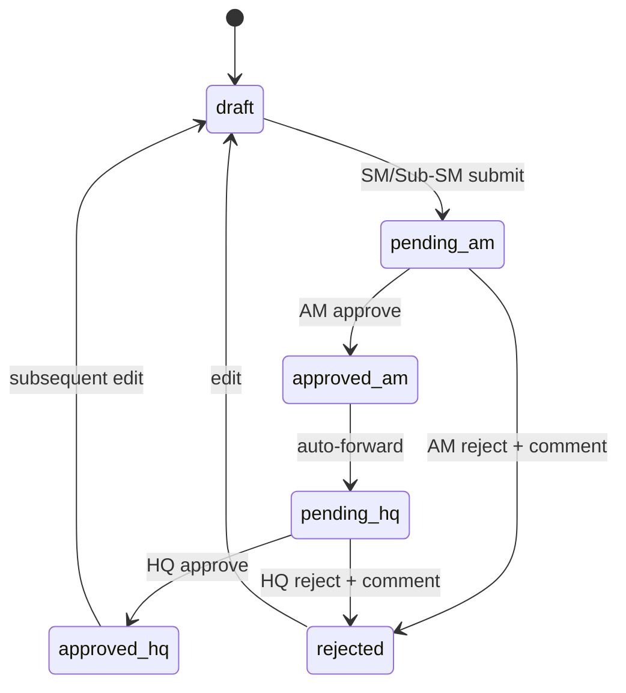
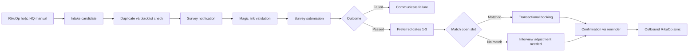

# PROJECT-DETAIL.md — Mô tả chức năng dự án Rakusai

## 1. Tổng quan

Rakusai là nền tảng quản lý tuyển dụng được xây dựng lại cho MH Holdings. Hệ thống hợp nhất việc thiết lập điều kiện tuyển dụng, phê duyệt, tiếp nhận và sàng lọc ứng viên, quản lý lịch phỏng vấn, thông báo và đồng bộ RikuOp vào một nguồn dữ liệu thống nhất thay cho hệ thống cũ kết hợp Google Sheets.

## 2. Mục tiêu

- Loại bỏ phân mảnh dữ liệu và phụ thuộc vào spreadsheet.
- Cho AM/SM/Sub-SM thực hiện daily operations trên smartphone; vẫn hỗ trợ layout PC. HQ vận hành PC-first.
- Cấp account cá nhân cho internal user để thực thi RBAC và audit trail.
- Tự động hóa candidate pipeline thông qua RikuOp, survey, scheduling và notification.
- Bảo vệ state machine, data scope, token lifecycle và concurrent updates.

## 3. Phạm vi

### Trong phạm vi

- Full rebuild trên codebase mới.
- RikuOp candidate intake và status/schedule synchronization, phụ thuộc final integration contract.
- Import/export master data Area, Store, SM, Sub-SM và AM.
- Recruitment Requirement authoring, versioning và approval.
- Interview slot, booking, schedule change/cancel và reminder.
- Candidate survey webview qua magic link.
- Duplicate detection và blacklist management.
- Internal/candidate notification qua Email và SMS.
- Audit cho mọi mutating request.

### Ngoài phạm vi đã xác nhận

- Migration dữ liệu lịch sử từ legacy system.
- Automatic monthly reset của approval status.
- IP-address-based access restriction.
- URL lookup by email screen.
- Candidate account issuance/candidate login.
- Role Switcher ở Header.
- Mock business data hoặc URL query parameters dùng để giả lập state.

## 4. Actor và quyền

| Actor | Cách truy cập | Data scope | Chức năng chính |
|---|---|---|---|
| HQ | ID/password, PC-first | Tất cả store và candidate | Confirm/edit/export requirement, quản lý schedule toàn hệ thống, manual candidate registration/assignment, blacklist, master data import/export |
| AM | ID/password, mobile-first và PC layout | Area được phân công; store trực tiếp quản lý có scope như SM | Approve/reject requirement trong area; author requirement tại store trực tiếp quản lý và self-approve bước AM |
| SM | ID/password, mobile-first và PC layout | Store được phân công | Author/edit/submit requirement, mở interview slot, điều chỉnh schedule |
| Sub-SM | ID/password, mobile-first và PC layout | Store được phân công | Cùng quyền vận hành với SM và cùng sửa shared requirement record |
| Candidate | Dedicated magic-link URL, không account | Survey/result/reminder của chính candidate | Submit survey, xem kết quả và reminder |

Authorization được thực thi ở FE route và BE role/data-scope guard. BE là nguồn quyết định cuối cùng; mọi query phải giới hạn theo store/area để chặn IDOR.

## 5. Quan hệ tổ chức

- Một AM có thể phụ trách nhiều Area.
- Một Area có nhiều Store.
- Store và SM/Sub-SM là quan hệ N:N.
- Mỗi Store có đúng một primary SM; các manager còn lại là Sub-SM theo mô hình hiện tại.
- Một manager có thể phụ trách nhiều Store, vì vậy availability phải được kiểm tra xuyên Store.

## 6. Các module chức năng

### 6.1 Identity, Access & Audit

- Login bằng ID/password cho HQ, AM, SM và Sub-SM.
- Quên/đặt lại mật khẩu dùng reset token duy nhất, có TTL và không được replay; exact endpoint/TTL chưa được nguồn xác định.
- Account unknown được provision trong master-data import và thông báo qua email.
- Password lưu salted hash bằng bcrypt hoặc argon2.
- Role guard kiểm tra role; scope guard kiểm tra area/store ownership.
- Audit interceptor ghi actor, action, entity, before/after payload cho POST/PUT/PATCH/DELETE; không ghi GET.
- Candidate không đi qua module internal authentication.

### 6.2 Master Data

- HQ import/export Area, Store và assignment AM/SM/Sub-SM bằng Excel/CSV.
- Import validate file, xử lý row và ghi kết quả mỗi run vào `master_data_import_logs`.
- Tạo account cho manager chưa tồn tại.
- Exact column layout của job requirement và master-data link import/export vẫn chưa được xác nhận.

### 6.3 Recruitment Requirement

- Mỗi Store có tối đa một requirement cho mỗi channel `web` hoặc `other_media`.
- SM/Sub-SM tạo Draft và có thể lưu khi chưa đủ field bắt buộc.
- Submit mới validate toàn bộ business schema.
- Mỗi edit cycle tạo immutable `job_requirement_versions`.
- `current_version_id` là version đang edit/review; `published_version_id` là version candidate thấy.
- Approval action được append vào `approval_actions`; reject bắt buộc có comment.

#### Approval state machine

Trường hợp đặc biệt: AM author requirement cho store họ trực tiếp quản lý thì submission tự qua bước AM và chuyển thẳng tới Pending HQ Review.

### 6.4 Candidate Engagement

1. Candidate đi vào từ RikuOp hoặc HQ manual registration.
2. Hệ thống normalize payload, kiểm tra duplicate và blacklist.
3. Candidate hợp lệ nhận magic link qua SMS/Email.
4. Khi resolve token, BE kiểm tra hash, expiry, use state, Store và published requirement.
5. Store chưa có published requirement hiển thị “form is being prepared”; Store stopping/closing hiển thị pause notice.
6. Nếu Store không cho car commute, survey hiển thị notice phù hợp.
7. Candidate submit survey; câu trả lời được validate và lưu.
8. Hệ thống/SM/HQ xác định Passed hoặc Failed theo flow được requirement mô tả.
9. Candidate chọn tối đa ba preferred date/time theo thứ tự ưu tiên; slot trong 36 giờ tới không được hiển thị.
10. Matching thử theo thứ tự ưu tiên. Nếu không có slot, candidate chuyển sang Interview Adjustment Needed để SM/HQ phối hợp thủ công.
11. Khi kết quả chính thức được submit, candidate xem kết quả qua token: online pass có web interview URL/hướng dẫn; onsite pass có địa điểm/hướng dẫn; failed hiển thị thông báo từ chối. Candidate không được xem kết quả trước khi quyết định được submit.

#### Candidate lifecycle

| Status nghiệp vụ | Ý nghĩa |
|---|---|
| Received | Intake hoàn tất và đã chạy duplicate/blacklist check |
| Survey Sent | Magic link đã được dispatch |
| Survey Completed | Candidate đã submit survey |
| No Response | Sau 5 ngày không submit survey |
| Passed / Failed | Kết quả screening/decision đã được xác định |
| Interview Scheduled | Slot đã book |
| Interview Adjustment Needed | Không có slot phù hợp, cần điều chỉnh thủ công |
| Completed / Cancelled | Trạng thái kết thúc |

Lưu ý: domain state `Interview Adjustment Needed` có trong mô tả nghiệp vụ nhưng chưa có value tương ứng trong enum `candidates.status` của bảng hiện tại; đây là issue contract cần xử lý trước migration.

### 6.5 Scheduling

- SM/Sub-SM mở slot theo ngày, start/end time và interview type.
- Slot thuộc một responsible SM và một Store.
- Không tạo slot trong quá khứ hoặc trùng/chồng chéo availability của cùng manager.
- HQ xem lịch toàn hệ thống theo date, Area, Store và Manager.
- Candidate chỉ thấy slot eligible của Store.
- Booking chốt một candidate vào một slot trong DB transaction.
- Schedule chứa interview type và `location_info` cho address/directions hoặc web interview URL.
- Slot `open` có thể được hủy/xóa theo rule; slot đã booked phải xử lý schedule và notification trước.

#### Concurrency invariants

- Concurrent SM/Sub-SM requirement edit không được silent overwrite.
- HQ và SM cùng book một slot: transaction commit đầu tiên thắng, request sau nhận conflict và re-fetch.
- Cùng SM không được book cùng thời điểm tại hai Store.

### 6.6 Notification

| Event | Recipient | Channel | Timing |
|---|---|---|---|
| SM submit requirement | AM | Email | Immediate |
| AM reject requirement | SM, Sub-SM | Email | Immediate, kèm comment |
| AM approve requirement | HQ | Email | Immediate |
| Approval reminder | AM | Email | Sau 3 ngày, sau đó hàng ngày tới khi xử lý |
| Edit reminder | SM | Email | Sau 3 ngày từ reject, sau đó hàng ngày tới khi resubmit |
| Survey/result/schedule change/cancel | Candidate | SMS/Email | Immediate theo event |
| Interview reminder | Candidate | SMS/Email | 1 ngày trước interview |

Mọi notification được persist với `idempotency_key`, dispatch qua BullMQ và chuyển `scheduled` → `sent` hoặc `failed`. Failed sau bounded retry phải visible cho HQ.

### 6.7 RikuOp Integration

- Anti-corruption layer map payload RikuOp với internal domain.
- Inbound candidate intake qua webhook hoặc polling; cơ chế cuối cùng chờ integration contract.
- Outbound sync status change, memo update và interview set/change/cancel.
- Unexpected response shape được ghi như contract mismatch.
- Tất cả request/response outcome được lưu tại `rikuop_sync_logs`.

## 7. Luồng end-to-end chính

## 8. Non-functional requirements

### Security

- Server-side DTO validation dù FE đã validate.
- Uniform guards cho endpoint.
- Rate limit public candidate endpoints.
- Secrets qua environment variables/AWS Secrets Manager.
- helmet, hpp, sanitizer, express-rate-limit và structured logging.
- Không lộ password/token trong response/log.

### Reliability và consistency

- Optimistic/pessimistic locking theo use case.
- Unique constraint bảo vệ invariant xuyên store.
- Notification idempotency và bounded retry.
- Health endpoint kiểm tra DB, Redis và dependent services phù hợp.

### Timezone

- Business logic và UI theo `Asia/Tokyo`.
- Timestamp persist UTC.

### Extensibility

- Bounded contexts theo domain.
- JSONB cho content được xác định là hay thay đổi.
- Junction table cho assignment.
- `created_by`/`updated_by` và `audit_logs` cho accountability.

## 9. Open items

| Nhóm | Nội dung |
|---|---|
| Trong design | HQ-only PC visual direction |
| Trong design | UX để HQ chọn responsible SM khi thêm slot cho Store nhiều manager |
| Trong design | Reference cho smartphone schedule-setting calendar |
| Trong design | Requirement list unified hay tách in-progress/regular |
| Trước implementation | Job requirement import file format |
| Trước implementation | Master-data link import/export file format |
| Trước implementation | Reminder send-volume caps, send-time windows và holiday handling |
| Trước release | Legacy/new-system cutover date |
| Integration contract | RikuOp inbound webhook hay polling và payload contract đầy đủ |
