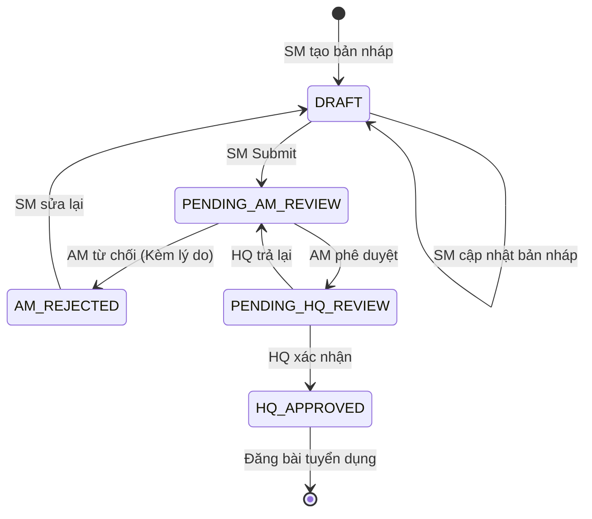
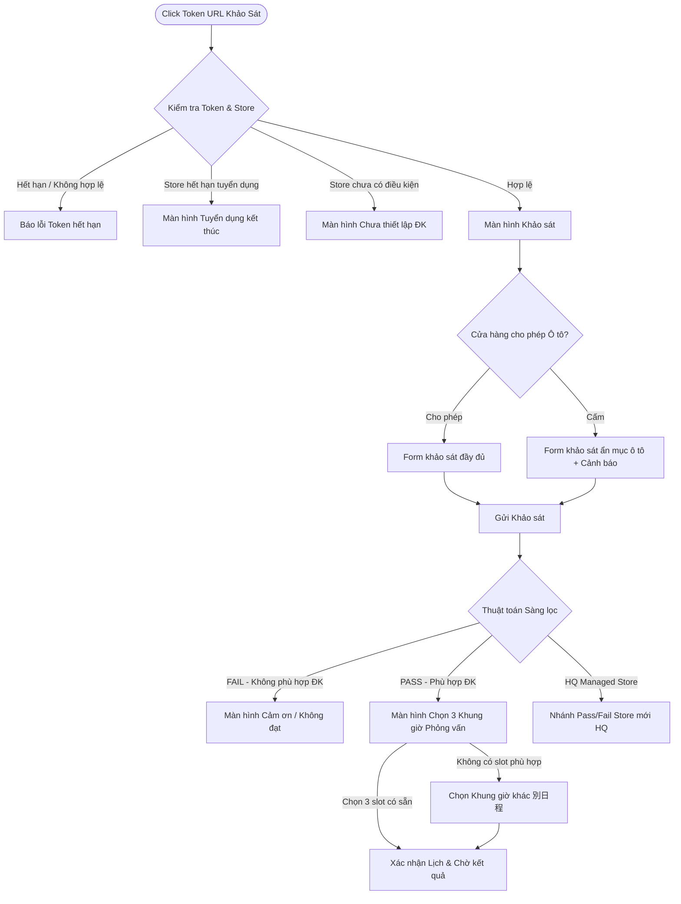

# BẢNG ĐIỀU KIỆN & QUY TẮC RÀNG BUỘC TRIỂN KHAI (RUNBOOK & TEST BLUEPRINT)

> **Mục đích tài liệu:**  
> 1. Quy định rõ ràng các ràng buộc nghiệp vụ cốt lõi, loại bỏ các phần nhiễu để **TUYỆT ĐỐI TRÁNH LÀM NHẦM**.  
> 2. Đóng vai trò là **Bản mẫu kiểm thử toàn diện (Master End-to-End Test Blueprint)** để rà soát toàn bộ luồng nghiệp vụ hệ thống, phát hiện các bước còn thiếu, xử lý sót hoặc các lỗ hổng logic/bảo mật tiềm ẩn.

---

## 🚫 1. CÁC ĐIỀU KIỆN & PHẠM VI BỊ LOẠI BỎ (OUT OF SCOPE - CẤM LÀM)

1. **Tuyệt đối KHÔNG DÙNG Mock Data (No Mock Data)**:
   - Nghiêm cấm tạo hoặc sử dụng dữ liệu giả (hardcoded mock data / array tĩnh) trên Frontend.
   - Toàn bộ danh sách, form nhập liệu, bộ lọc, trạng thái phải kết nối trực tiếp với Database thông qua REST API thực tế.
   - Tuyệt đối không dùng query params trên URL để "giả lập" trạng thái pass/fail hoặc thông tin ứng viên.

2. **Chỉ làm trên DESKTOP (PC Only - Bỏ qua Mobile)**:
   - Toàn bộ giao diện hệ thống chỉ thiết kế và tối ưu duy nhất cho màn hình **Desktop (PC)** với chuẩn độ phân giải máy tính (1280px - 1920px).
   - Bỏ qua toàn bộ 42 frame giao diện cho điện thoại di động (Mobile / Smartphone). Không code responsive mobile, không dựng bottom sheet / mobile drawer cho điện thoại.

3. **BỎ HOÀN TOÀN Role Switcher (Chuyển đổi vai trò nhanh)**:
   - Loại bỏ dropdown chọn nhanh vai trò ở Header.
   - Đăng nhập bằng tài khoản nào (`HQ`, `AM`, `SM`, `Sub-SM`) thì hệ thống điều hướng trực tiếp về Dashboard của Role đó và phân quyền chặt chẽ bằng Role Guard (cả Frontend và Backend).

4. **BỎ HOÀN TOÀN Tích hợp Đồng bộ RikuOp**:
   - Bỏ qua toàn bộ logic, Webhook, API và Background Jobs liên quan đến việc đồng bộ dữ liệu hai chiều với hệ thống ngoài RikuOp.

---

## 🔄 2. MA TRẬN KIỂM THỬ TOÀN BỘ LUỒNG HỆ THỐNG (END-TO-END FLOW TEST MATRIX)

---

### LUỒNG 1: XÁC THỰC, PHÂN QUYỀN & QUẢN LÝ PHIÊN (AUTH & RBAC)

| Bước | Hành động & Vai trò | Dữ liệu đầu vào / Điều kiện | Kỳ vọng hệ thống (API & DB) | Kiểm tra lỗ hổng & Trường hợp biên |
|---|---|---|---|---|
| **1.1** | **Đăng nhập (Login)** *Actor: HQ, AM, SM, Sub-SM* | `login_id`, `password` | - Trả về HTTP 200 + JWT Token + Thông tin Role. - Lưu session token vào Storage. - Chuyển hướng đúng Dashboard theo Role. | ❌ Nhập sai pass quá số lần cho phép. ❌ Tài khoản bị vô hiệu hóa / chưa kích hoạt. ❌ Password để lộ dạng plaintext trong response hoặc log. |
| **1.2** | **Phân quyền truy cập (Role Guard)** *Actor: Mọi Role* | User cố tình gõ trực tiếp URL của Role khác trên trình duyệt. | - Chặn truy cập (Redirect về Unauthorized 403 hoặc Login). - Backend trả về `403 Forbidden` nếu cố gọi API ngoài thẩm quyền. | ❌ **Lỗ hổng IDOR:** SM sửa ID trên URL/API để xem/sửa dữ liệu của store khác. ❌ AM phê duyệt store thuộc Area của AM khác. |
| **1.3** | **Quên & Đặt lại mật khẩu** *Actor: Mọi Role* | Email đăng ký | - Gửi email chứa Reset Token duy nhất. - Đặt lại mật khẩu mới, mã hóa Argon2/Bcrypt trong DB. | ❌ Token reset bị dùng lại nhiều lần (Replay attack). ❌ Token reset không có thời hạn hết hạn (TTL). |

---

### LUỒNG 2: THIẾT LẬP CỬA HÀNG & MASTER DATA (HQ STORE & MASTER SETUP)

| Bước | Hành động & Vai trò | Dữ liệu đầu vào / Điều kiện | Kỳ vọng hệ thống (API & DB) | Kiểm tra lỗ hổng & Trường hợp biên |
|---|---|---|---|---|
| **2.1** | **Import / Export Master Data** *Actor: HQ* | File CSV/Excel danh sách Khu vực (Area), Cửa hàng (Store), Phân công Quản lý. | - Validate định dạng file. - Parse và Upsert vào DB theo transaction (nếu lỗi 1 dòng phải rollback hoặc báo lỗi chi tiết từng dòng). | ❌ File rỗng, file sai định dạng hoặc dung lượng quá lớn. ❌ Trùng mã Area / mã Store. ❌ Xóa nhầm dữ liệu đang có ràng buộc khóa ngoại với đơn tuyển dụng. |
| **2.2** | **Thiết lập Cửa hàng mới (New Store Setup)** *Actor: HQ* | Tên Store, Area, Địa chỉ, Loại hình, Phân công SM/Sub-SM, Hạn chót tuyển dụng. | - Tạo mới bản ghi `Store` trong DB. - Gán quan hệ Store - User (SM/Sub-SM). | ❌ Tạo store không gán Area. ❌ Gán SM chưa tồn tại hoặc tài khoản SM không đúng Role. |

---

### LUỒNG 3: VÒNG ĐỜI PHÊ DUYỆT ĐIỀU KIỆN TUYỂN DỤNG (RECRUITMENT TERMS: SM ➔ AM ➔ HQ)

| Bước | Hành động & Vai trò | Dữ liệu đầu vào / Điều kiện | Kỳ vọng hệ thống (API & DB) | Kiểm tra lỗ hổng & Trường hợp biên |
|---|---|---|---|---|
| **3.1** | **Tạo & Lưu bản nháp** *Actor: SM / Sub-SM* | Thông tin tuyển dụng (Ca làm, mức lương, độ tuổi, yêu cầu xe cộ, kênh WEB/Other). | - Lưu bản ghi với trạng thái `DRAFT`. - Cho phép lưu từng phần dù chưa điền đủ các trường bắt buộc. | ❌ Sub-SM tạo đè lên bản nháp đang sửa của SM (Thiếu cơ chế Optimistic Lock/Version check). |
| **3.2** | **Nộp phê duyệt (Submit)** *Actor: SM / Sub-SM* | Bản nháp đầy đủ thông tin bắt buộc. | - Validate toàn bộ schema nghiệp vụ. - Đổi trạng thái `DRAFT` ➔ `PENDING_AM_REVIEW`. - Bắn thông báo/event cho AM phụ trách Area đó. | ❌ Nộp khi thiếu trường bắt buộc. ❌ Nộp khi điều kiện tuyển dụng trước đó của store vẫn đang trong tiến trình duyệt. |
| **3.3** | **AM Xét duyệt / Từ chối** *Actor: AM* | Danh sách điều kiện thuộc Area mình quản lý. | - **Approve:** Chuyển trạng thái ➔ `PENDING_HQ_REVIEW`. - **Reject:** BẮT BUỘC nhập lý do ➔ Chuyển trạng thái ➔ `AM_REJECTED`. | ❌ **Lỗ hổng Logic:** Reject nhưng gửi lý do rỗng. ❌ AM duyệt được store không thuộc Area của mình. ❌ SM tự ý duyệt bỏ qua bước AM. |
| **3.4** | **HQ Xác nhận cuối cùng** *Actor: HQ* | Danh sách điều kiện ở trạng thái `PENDING_HQ_REVIEW`. | - **Approve:** Chuyển trạng thái ➔ `HQ_APPROVED` (Hiệu lực đăng tuyển). - **Return:** Trả lại kèm góp ý. | ❌ Duyệt điều kiện chưa qua AM phê duyệt. ❌ Sửa đổi nội dung form khi đang ở bước HQ mà không lưu vết Audit Log. |

---

### LUỒNG 4: QUẢN LÝ KHUNG GIỜ RẢNH & LỊCH TRÌNH (TIMELINE & SLOTS)

| Bước | Hành động & Vai trò | Dữ liệu đầu vào / Điều kiện | Kỳ vọng hệ thống (API & DB) | Kiểm tra lỗ hổng & Trường hợp biên |
|---|---|---|---|---|
| **4.1** | **Tạo Khung giờ rảnh (空き枠)** *Actor: SM / Sub-SM* | Ngày, Giờ bắt đầu, Giờ kết thúc, Loại phỏng vấn (Online / Offline / Cả hai). | - Tạo bản ghi `InterviewSlot` với trạng thái `OPEN` trong DB. - Hiển thị trên Calendar của Store. | ❌ Tạo slot trong quá khứ. ❌ Trùng lặp/chồng chéo thời gian với slot đã có của chính Manager đó. ❌ Manager quản lý 2 store bị trùng lịch ở cả 2 nơi. |
| **4.2** | **HQ Kiểm tra Lịch toàn hệ thống** *Actor: HQ* | Bộ lọc ngày, Area, Store, Manager. | - Hiển thị lưới Timeline toàn quốc trực quan. - Phân biệt rõ: Slot trống (`OPEN`), Slot đã có ứng viên (`BOOKED`), Slot bận chéo. | ❌ Load dữ liệu quá lớn làm đơ UI (Cần phân trang / filter theo ngày cụ thể). |
| **4.3** | **Xóa / Hủy Slot rảnh** *Actor: SM / HQ* | `slot_id` | - Nếu slot đang `OPEN`: Xóa mềm hoặc đổi trạng thái `CANCELLED`. - Nếu slot đã có ứng viên `BOOKED`: Báo lỗi hoặc yêu cầu hủy lịch phỏng vấn trước. | ❌ Xóa nhầm slot đã có ứng viên xác nhận mà không thông báo cho ứng viên. |

---

### LUỒNG 5: ỨNG VIÊN - KHẢO SÁT, TỰ ĐỘNG SÀNG LỌC & ĐẶT LỊCH (APPLICANT FLOW)

| Bước | Hành động & Vai trò | Dữ liệu đầu vào / Điều kiện | Kỳ vọng hệ thống (API & DB) | Kiểm tra lỗ hổng & Trường hợp biên |
|---|---|---|---|---|
| **5.1** | **Truy cập qua URL Token** *Actor: Ứng viên* | Link chứa Token duy nhất gửi qua Email/SMS. | - Kiểm tra tính hợp lệ và thời hạn của Token. - Trả về thông tin Store và phân nhánh giao diện phù hợp. | ❌ Token hết hạn nhưng vẫn cho điền form. ❌ Dùng 1 Token submit nhiều lần (Replay). ❌ Lộ thông tin nhạy cảm của ứng viên khác qua Token. |
| **5.2** | **Xác định Phân nhánh Khảo sát** *Actor: Hệ thống* | Trạng thái Store & Điều kiện tuyển dụng. | - Nếu Store đóng tuyển dụng ➔ Màn hình `recruitement-end`. - Nếu Store chưa cấu hình ➔ Màn hình `not-have-recruitement`. - Nếu Store cấm xe hơi ➔ Ẩn ô tô + hiện warning. | ❌ Hiển thị form phỏng vấn của store đã ngừng tuyển dụng. ❌ Ứng viên chọn phương tiện ô tô ở store cấm ô tô. |
| **5.3** | **Điền Form & Tự động Sàng lọc** *Actor: Ứng viên* | Thông tin cá nhân, Ca làm việc, Số ngày/tuần, Thời hạn gắn bó, Bằng cấp/Kinh nghiệm. | - Lưu câu trả lời vào `ApplicantSurveyAnswer`. - So khớp tự động với tiêu chí `RecruitmentTerm` của Store. - Phân loại: `SCREENING_PASSED` hoặc `SCREENING_FAILED`. | ❌ Trượt sàng lọc nhưng vẫn nhảy sang màn hình chọn ngày. ❌ Ứng viên nằm trong Blacklist nhưng không bị chặn/cảnh báo. |
| **5.4** | **Chọn 3 Khung giờ ưu tiên** *Actor: Ứng viên Pass* | Chọn Ưu tiên 1, 2, 3 từ danh sách Slot trống (`OPEN`) của Store. | - Lưu 3 nguyện vọng vào `ApplicantSlotPreference`. - Đổi trạng thái ứng viên ➔ `WAITING_INTERVIEW_ADJUSTMENT`. | ❌ Chọn trùng 1 slot cho cả 3 nguyện vọng. ❌ Slot vừa bị ứng viên khác đặt trước đó (Race Condition). |
| **5.5** | **Yêu cầu Lịch khác (別日程)** *Actor: Ứng viên Pass* | Nhập khoảng thời gian mong muốn nếu không có slot nào phù hợp. | - Lưu yêu cầu vào DB. - Đánh dấu cờ cần SM/HQ liên hệ trực tiếp xếp lịch. | ❌ Nhập khoảng ngày trong quá khứ hoặc thời gian bất hợp lý. |

---

### LUỒNG 6: CHỐT LỊCH PHỎNG VẤN & THÔNG BÁO KẾT QUẢ (SM ADJUSTMENT & REMINDER)

| Bước | Hành động & Vai trò | Dữ liệu đầu vào / Điều kiện | Kỳ vọng hệ thống (API & DB) | Kiểm tra lỗ hổng & Trường hợp biên |
|---|---|---|---|---|
| **6.1** | **SM Chốt Lịch Phỏng vấn** *Actor: SM / Sub-SM* | Danh sách ứng viên cần xếp lịch; chọn 1 trong 3 khung giờ ứng viên đã đăng ký. | - Cập nhật `InterviewSlot` ➔ `BOOKED`. - Tạo bản ghi `Interview` chính thức gắn với Applicant. - Đổi trạng thái Slot không được chọn về lại `OPEN`. | ❌ **Race condition:** SM và HQ cùng lúc chốt 2 ứng viên vào cùng 1 slot. ❌ Chốt lịch ngoài khung giờ ứng viên có thể tham gia. |
| **6.2** | **Xem Kết quả Chính thức** *Actor: Ứng viên* | Truy cập Token xem kết quả sau khi SM đã đánh giá. | - **Pass Online:** Màn hình hướng dẫn + Link Zoom/Teams. - **Pass Offline:** Màn hình hướng dẫn + Bản đồ địa điểm phỏng vấn. - **Fail:** Màn hình từ chối lịch sự. | ❌ Ứng viên xem được kết quả khi SM chưa bấm submit duyệt. ❌ Link phỏng vấn Online bị rỗng hoặc sai định dạng URL. |
| **6.3** | **Gửi Nhắc nhở Tự động (Reminder Job)** *Actor: Background Job* | Cron job chạy định kỳ quét các lịch phỏng vấn trước 1 ngày / 2 giờ. | - Gửi Email/SMS nhắc lịch cho ứng viên. - Cập nhật trạng thái `REMINDER_SENT`. | ❌ Job chạy lặp gửi spam nhiều email cho 1 ứng viên. ❌ Lịch đã bị hủy (Cancelled) nhưng vẫn gửi email nhắc nhở. |

---

### LUỒNG 7: QUẢN LÝ DANH SÁCH ĐEN & ĐỐI SOÁT TRÙNG LẶP (BLACKLIST & DUPLICATES)

| Bước | Hành động & Vai trò | Dữ liệu đầu vào / Điều kiện | Kỳ vọng hệ thống (API & DB) | Kiểm tra lỗ hổng & Trường hợp biên |
|---|---|---|---|---|
| **7.1** | **Quản lý Danh sách đen (Blacklist CRUD)** *Actor: HQ* | Họ tên (Kanji/Kana), Ngày sinh, Số điện thoại, Email chính, Email phụ, Lý do. | - Lưu bản ghi vào bảng `Blacklist`. - Ghi nhận người tạo và thời gian tạo. | ❌ Nhập thiếu số điện thoại hoặc họ tên. ❌ User không phải HQ nhưng gọi được API tạo Blacklist. |
| **7.2** | **Đối soát tự động khi Ứng viên nộp đơn** *Actor: Hệ thống* | Dữ liệu ứng viên mới nộp. | - So khớp chính xác: SĐT HOẶC Email HOẶC (Họ tên Kana + Ngày sinh). - Nếu khớp: Gắn cờ cảnh báo hoặc tự động từ chối. | ❌ Ứng viên cố tình nhập sai 1 dấu cách/viết thường để bypass đối soát. ❌ So khớp nhầm người do trùng tên nhưng khác ngày sinh/SĐT. |

---

## 🔍 3. CHECKLIST KIỂM TRA LỖ HỔNG LOGIC & BẢO MẬT (GAP & VULNERABILITY CHECKLIST)

### 🛡️ A. Lỗ hổng Phân quyền & Ranh giới Dữ liệu (IDOR & Multi-tenancy)
- [ ] **Chặn IDOR trên tất cả Endpoint**: Đảm bảo SM không thể xem/sửa `Store`, `RecruitmentTerm`, `Interview` của Store khác bằng cách thay đổi ID trong URL/Body.
- [ ] **Ranh giới Khu vực của AM**: Đảm bảo AM chỉ thấy và duyệt các đơn thuộc danh sách Area được phân công trong bảng `UserAreaAssignment`.
- [ ] **Phân quyền thao tác HQ**: Chỉ tài khoản có Role `HQ` mới có quyền truy cập Blacklist, Import/Export Master và All-store Calendar.

### ⚡ B. Xung đột Đồng thời & Tranh chấp Dữ liệu (Race Conditions & Concurrency)
- [ ] **Tranh chấp Slot phỏng vấn**: Hai ứng viên cùng chọn 1 slot ở cùng 1 giây -> Phải có Database Transaction / Row Locking để người thứ hai nhận thông báo "Slot đã có người chọn".
- [ ] **Tranh chấp duyệt đơn**: SM nộp đơn trong khi AM đang xem bản nháp cũ -> Đảm bảo hiển thị đúng phiên bản mới nhất.

### ⏱️ C. Vòng đời Token & Bảo mật URL (Token Lifecycle)
- [ ] **One-time / Expiring Survey Token**: Token khảo sát phải có thời hạn (ví dụ: 7 ngày) và bị vô hiệu hóa sau khi hoàn tất quy trình.
- [ ] **Chống Brute-force Token**: Rate limit các endpoint public của ứng viên (`/api/public/*`) để chống dò tìm token.

### 🔄 D. Tính Toàn vẹn của Máy trạng thái (State Machine Integrity)
- [ ] **Chặn nhảy cóc trạng thái (Invalid State Transitions)**:
  - CẤM chuyển từ `DRAFT` thẳng lên `HQ_APPROVED` (bắt buộc qua `PENDING_AM_REVIEW` -> `PENDING_HQ_REVIEW`).
  - CẤM AM phê duyệt đơn đang ở trạng thái `DRAFT` hoặc `HQ_APPROVED`.
  - CẤM hủy phỏng vấn khi trạng thái đã hoàn thành (`COMPLETED`).

### 📝 E. Ràng buộc Dữ liệu & Xử lý Ngoại lệ (Data Validation & Edge Cases)
- [ ] **Xử lý Store không có Manager**: Đơn tuyển dụng của Store mới chưa có SM phải do HQ trực tiếp tạo và duyệt.
- [ ] **Validation lý do từ chối**: Khi AM hoặc HQ reject, trường `rejection_reason` là BẮT BUỘC, không được chứa toàn khoảng trắng.
- [ ] **Xử lý múi giờ & Lịch làm việc**: Toàn bộ thời gian hiển thị và lưu trữ phải đồng nhất theo múi giờ Nhật Bản (JST / UTC+9), không bị lệch giờ khi chạy trên các máy client khác nhau.

---

## 🎯 4. HƯỚNG DẪN THỰC HIỆN TEST TỪNG BƯỚC (QUICK SMOKE TEST SCENARIO)

Để kiểm tra hệ thống hoạt động trơn tru từ đầu đến cuối, chạy kịch bản 10 bước sau:

1. **Bước 1 (HQ):** Đăng nhập tài khoản HQ -> Kiểm tra danh sách Store và Master Data.
2. **Bước 2 (HQ):** Thêm 1 bản ghi vào Blacklist (Ví dụ: Nguyễn Văn A - 0901234567).
3. **Bước 3 (SM):** Đăng nhập tài khoản SM -> Tạo 3 khung giờ rảnh (`空き枠`) trên Calendar ngày mai.
4. **Bước 4 (SM):** Tạo điều kiện tuyển dụng mới -> Lưu nháp (`DRAFT`) -> Bấm `Submit` nộp duyệt.
5. **Bước 5 (AM):** Đăng nhập tài khoản AM -> Vào mục Phê duyệt -> Thấy đơn `Pending AM` -> Bấm `Approve`.
6. **Bước 6 (HQ):** Đăng nhập lại HQ -> Thấy đơn `Pending HQ` -> Bấm `Xác nhận (HQ Approved)`.
7. **Bước 7 (Ứng viên):** Mở link khảo sát với Token hợp lệ -> Điền thông tin (trùng với Blacklist ở Bước 2 để test chặn, sau đó đổi tên hợp lệ để test pass).
8. **Bước 8 (Ứng viên):** Qua bước Khảo sát đạt tiêu chí -> Chọn 3 slot rảnh do SM tạo ở Bước 3.
9. **Bước 9 (SM):** Đăng nhập SM -> Vào màn hình Điều chỉnh lịch -> Thấy ứng viên -> Chốt 1 khung giờ phỏng vấn.
10. **Bước 10 (Ứng viên):** Mở lại link kết quả -> Thấy màn hình thông báo Pass và thời gian phỏng vấn đã được chốt chính xác.
